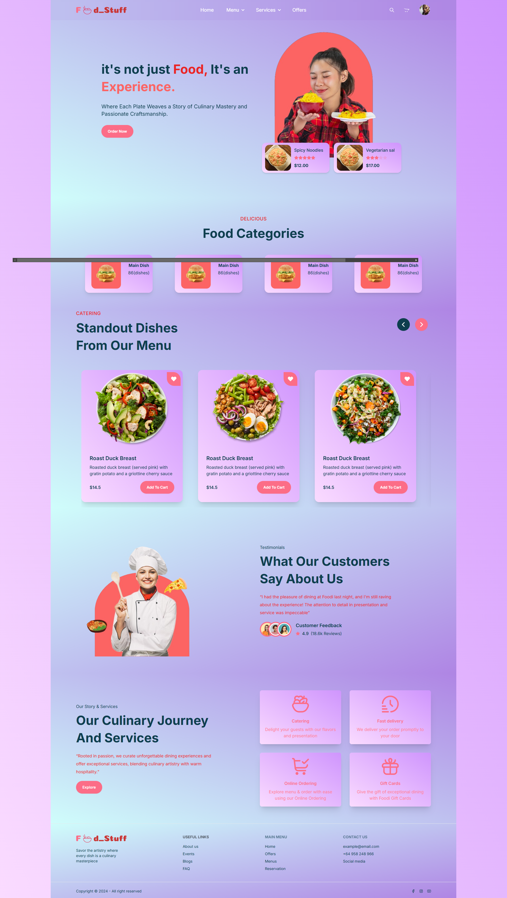
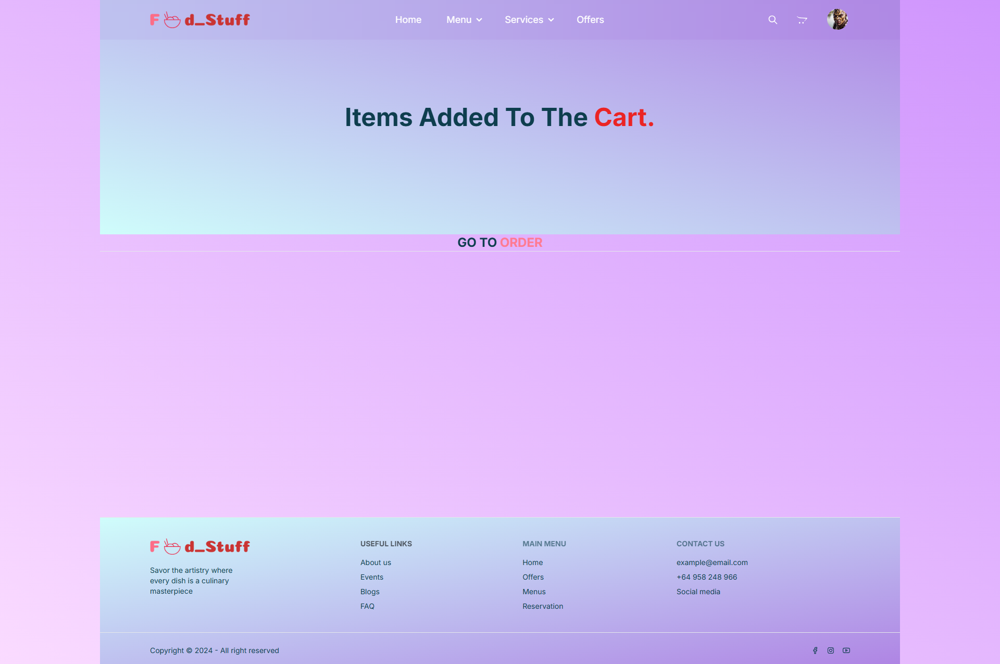

# FoodStuff App

## Overview
The **FoodStuff App** is designed to facilitate seamless ordering and delivery of food. It offers a user-friendly interface and robust backend to handle orders, payments, and user data securely. The app integrates key technologies to provide a smooth and efficient user experience.

## Features
- **User-Friendly Interface**: Intuitive design for browsing and ordering food items.
- **Secure Payments**: Stripe integration for safe and fast transactions.
- **Real-Time Updates**: Notifications for order status and delivery tracking.
- **Responsive Design**: Optimized for mobile and desktop devices.

## Tech Stack

### Backend
- **Express.js**: Backend framework for building RESTful APIs.
- **MongoDB**: Database for storing user and order data.
- **Mongoose**: ODM for MongoDB.
- **JWT**: For user authentication.
- **dotenv**: Environment variable management.
- **Stripe**: Payment processing.
- **Nodemon**: Development utility for live updates.
- **CORS**: Enabling cross-origin requests.

### Frontend
- **React**: For building the user interface.
- **React Router DOM**: For navigation and routing.
- **Axios**: For API requests.
- **Tailwind CSS**: For styling.
- **DaisyUI**: UI components for Tailwind CSS.
- **React Toastify**: For toast notifications.
- **SweetAlert2**: For alert pop-ups.
- **Firebase**: For authentication and backend services.
- **React Stripe.js**: For Stripe integration.
- **React Hook Form**: For managing forms.

## Installation

### Backend Setup
1. Clone the repository:
   ```bash
   git clone https://github.com/your-repo/foodstuff.git
   ```
2. Navigate to the backend directory:
   ```bash
   cd foodstuff
   ```
3. Install dependencies:
   ```bash
   npm install
   ```
4. Start the server:
   ```bash
   npm run dev
   ```

### Frontend Setup
1. Navigate to the frontend directory:
   ```bash
   cd food-stuff_client
   ```
2. Install dependencies:
   ```bash
   npm install
   ```
3. Start the development server:
   ```bash
   npm run dev
   ```

## Usage
- Open the app in your browser at `http://localhost:3000`.
- Browse food items, add them to your cart, and proceed to checkout.
- Use the secure payment gateway to complete your order.

## Screenshots
### Home Page


### Checkout Page


## Scripts
### Backend
- **Start in Production**:
  ```bash
  npm run start
  ```
- **Development**:
  ```bash
  npm run dev
  ```
- **Build**:
  ```bash
  npm run build
  ```

### Frontend
- **Development**:
  ```bash
  npm run dev
  ```
- **Build**:
  ```bash
  npm run build
  ```
- **Preview**:
  ```bash
  npm run preview
  ```

## License
This project is licensed under the [ISC License](LICENSE).

## Contact
For any inquiries, please contact **Utkarsh Raj** at [utkarshraj525@gmail.com](mailto:utkarshraj525@gmail.com).
